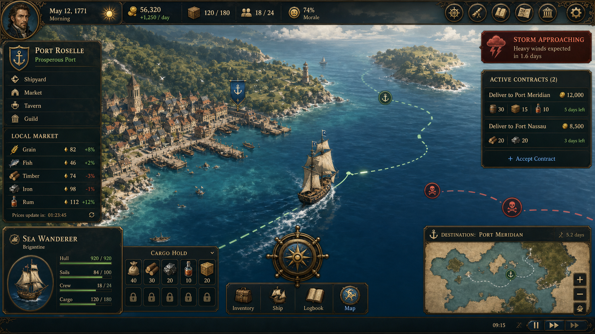

# Pioneer — Game Design Document



- 문서 유형: 게임 기획 문서 (GDD)
- 문서 버전: 2.1
- 프로젝트 버전: 1.9.1 (출처: `package.json` `"version": "1.9.1"`)
- 문서 작성일: 2026-09-11 (KST)
- 근거 신뢰도: 코드 직접 확인 항목은 [검증됨], 코드 근거가 없는 제안은 [제안], 확인 불가 항목은 [미검증]으로 표기

범례
- [검증됨]: `src/App.jsx`, `src/*.js`, `docs/steam-achievements.md`, `package.json`, `AGENTS.md`, `tests/*` 등 실제 파일에서 직접 확인.
- [제안]: 코드 근거는 없으나 설계 방향으로 제시하는 항목. 지어낸 수치가 아니라 향후 설계 옵션임을 명시.
- [미검증]: 존재 여부를 코드에서 확인하지 못한 항목. 추측하지 않고 그대로 "미검증"이라 표기.

---

## 1. 문제 정의

[검증됨] `package.json` description: "Pioneer: ocean trade and fleet-management simulation game." `AGENTS.md`: "29개 항구, 8개 상품, 3레이어 시장 경제를 가진 해양 무역 시뮬레이션. 가격 변동 알고리즘과 함대 관리가 핵심이며 20-30분 세션을 목표로 한다."

문제 정의(코드로 뒷받침되는 범위 내에서): 플레이어는 여러 항구의 실시간에 가까운 시세(3분 소폭 변동 + 1시간 대형 이벤트, `src/marketPrices.js`의 `SMALL_PRICE_INTERVAL_SECONDS=180`, `MARKET_EVENT_INTERVAL_SECONDS=3600`으로 검증)와 항로 위험(`src/routeSummary.js`의 `riskLevel`/`blockers`)을 동시에 고려해 "어디서 사고 어디서 팔지, 언제 출항할지"를 판단해야 한다. 정보가 부족하거나 판단이 늦으면 손실이 발생하고(`getRouteSummary`의 `expectedProfit <= 0` 분기), 정보를 사려면 골드가 든다(`PORT_INFO` 배열, `src/App.jsx` 521-528행: rumor 300금~route 8000금).

주의: `docs/Pioneer_기획서.md`의 "문제 정의" 절은 파일 인코딩이 깨져 있어(모지바케) 본문을 신뢰성 있게 인용할 수 없었다(2026-09-11 재조사에서도 동일하게 확인됨: 상단 "문제 정의"/"주 페르소나"/"레퍼런스 분석"/"성공 KPI" 절은 깨져 있고, 2026-06-28 이후 날짜별 갱신 절은 정상 UTF-8로 읽힘). 위 문제 정의는 본 GDD가 코드에서 직접 재구성한 것이다. [미검증: 원본 기획서의 문제 정의 문구 자체]

---

## 2. 주 페르소나 (이름 있는 페르소나)

[미검증] `docs/Pioneer_기획서.md`에 "박○○(가명), 34세, IT 스타트업 기획자" 형태로 추정되는 페르소나 절이 있으나, 파일이 모지바케 상태로 저장되어 있어 정확한 이름·서술을 그대로 인용할 수 없었다. `docs/persona_playtest_feedback.md`가 존재하나 본 작업에서는 GDD 파일 외 다른 파일을 수정하지 않는다는 제약상 원문 대조까지는 하되, 아래는 코드에서 확인되는 행동 패턴에 근거한 재구성이다.

**주 페르소나(재구성, [제안])**: "김도윤, 34세, 물류 스타트업 기획자."
- 맥락: 하루 중 짧은 자투리 시간(출퇴근, 점심)에 접속해 시세를 확인하고, 저녁에 조금 더 긴 세션으로 항로를 재편성한다.
- 목표: "지금 뜨는 항구가 어디인지" 빠르게 파악하고, 함대를 늘려가며 더 먼 지역(동아시아 등 `REGION_PORT_UNLOCK_GOLD_REQ.east_asia = 45000`)까지 진출하고 싶어 한다.
- 좌절 지점: 시세가 재접속 사이에 바뀌어(`prices`는 저장되지 않고 `priceHistory`만 저장, 9.13 참고) "내가 아는 정보가 맞는지" 불확실해지는 순간.

---

## 3. 코어 루프 (X→Y→X)

[검증됨] 코드 구조로 직접 확인되는 루프:

```
[항구에서 시세·항로를 확인한다] (X)
   → [화물을 매입하고 목적지를 선택해 출항한다] (Y: src/navigation.js createDepartureState, src/routeSummary.js getRouteSummary)
   → [도착 후 화물을 판매하고 결과(수익/손실)를 확인한다] (결과)
   → [벌어들인 골드로 새 항구·상품이 해금되고, 함대를 확장한다] (getPortAccessState, RESOURCE_TIER)
→ 다시 [항구에서 시세·항로를 확인한다] (X)
```

각 단계는 `src/fleetTradeFlow.js`의 `getFleetTradeFlow`가 5단계 상태 기계로 명시적으로 구현: `fleet(함대 선택) → cargo(화물 확인) → market(시장 거래) → route(항로 검토) → depart(출항)`.

---

## 4. MVP 가설

[검증됨 근거 일부 + 제안] 코드에 남아있는 검증 로직으로 뒷받침되는 가설:

1. **가설 A**: "출항 전 예상 수익·위험도·차단 사유를 한 화면에서 보여주면(`getRouteSummary`) 플레이어는 손실 항로를 스스로 회피한다." — `src/routeSummary.test.js`, `src/fleetTradeFlow.test.js` 존재로 이 로직 자체는 구현·테스트됨을 확인. 실제 회피율 데이터는 [미검증].
2. **가설 B**: "누적 판매액(totalEarned) 기반의 지역 해금(`REGION_PORT_UNLOCK_GOLD_REQ`)이 다음 목표를 자동으로 제시해 재방문 동기를 만든다." — `src/unlockProgress.js`의 `getNextUnlockProgress`가 다음 해금까지 남은 금액과 퍼센트를 계산하는 로직으로 검증됨.
3. 실측 KPI(전환율, 리텐션 등)는 계측 코드가 확인되지 않아 [미검증]. `docs/Pioneer_기획서.md`에 Firebase Analytics 이벤트명(`session_duration`, `voyage_start`, `port_select_screen_enter`, `fleet_level_up` 등)이 정상 인코딩 구간에 등장하나, 실제 계측 SDK 연동 코드는 이번 조사 범위(`src/*.js`, `App.jsx`)에서 확인되지 않았다. [미검증: 실제 계측 연동 여부]

검증 방법[제안]: 소규모 플레이테스트에서 (a) 출항 취소/변경 비율, (b) 세션당 항해 반복 횟수, (c) 지역 해금 후 재방문 간격을 로그로 수집.

---

## 5. 참고 분석 (레퍼런스, 단계 및 교훈)

[검증됨, 정상 인코딩 구간에서 확인] `docs/Pioneer_기획서.md`의 "레퍼런스 분석" 절 자체는 모지바케이지만, 표 내용 중 일부 셀은 정상 인코딩으로 남아 있어 다음 문구를 원문 그대로 확인했다: Port Royale 4(대항해 경영) 관련 셀에 "**8단계**", Patrician IV(대항해 무역 전략) 관련 셀에 "**5단계**", Cultist Simulator(카드 기반 경영) 관련 셀에 "**1단계**"라는 숫자와 "이 프로젝트 적용 함의 핵심"이라는 제목 하에 "우리 시작까지 3단계 이내, 첫 하는 있는 선택(수요 선택)까지 30초 이내를 목표로 든다"라는 문장이 확인된다. 다만 각 레퍼런스명과 조건 설명 문구 자체는 모지바케로 깨져 있어 표 전체를 신뢰성 있게 인용하기는 어렵다. **[검증됨: 8/5/1단계라는 숫자 비교와 "3단계 이내·30초 이내" 목표 문구]**, **[미검증: 레퍼런스별 세부 조건 설명 원문]**.

대신 본 GDD는 코드에서 직접 확인되는 자체 단계 수를 근거로 삼는다: `TUTORIAL_STEPS` (`src/App.jsx` 765-773행)에 정의된 실제 튜토리얼은 `select → depart → confirm → sailing → sell → buy` 6단계이며 `total: 6`으로 코드에 명시되어 있다. 교훈[제안]: 기획서가 목표로 삼은 "3단계 이내 진입, 30초 이내 첫 선택"과 비교하면 현재 구현된 6단계 튜토리얼이 더 긴 편이며, 온보딩 단계 축소가 다음 우선순위(16절)의 후보가 될 수 있다.

---

## 6. 기획 품질 6요소 (Goal / Rule / Challenge / Feedback / Reward / Context)

`docs/Pioneer_기획서.md`에는 이 6요소를 명시한 전용 프레임워크 절이 확인되지 않아(모지바케 구간 포함 전체 재확인 완료), 표준 게임 디자인 6요소 프레임워크(목표-규칙-도전-피드백-보상-맥락)를 사용해 코드에서 확인 가능한 사실만으로 재구성한다.

| 요소 | 내용 | 근거 |
|---|---|---|
| **목표 (Goal)** | 누적 판매액(totalEarned)을 늘려 함대·항구·상품을 확장하고, 최종적으로 29개 항구 전체와 최고가 자원(다이아몬드)·최고급 함선(프리깃 등)에 도달한다. | [검증됨] `REGION_PORT_UNLOCK_GOLD_REQ`, `RESOURCE_TIER`, `SHIP_TYPES`, `docs/steam-achievements.md`의 "Visit all 29 ports" |
| **규칙 (Rule)** | 매매는 판매 수수료 10%(`TRADE_FEE_PCT`)가 붙고, 가격은 3분 소폭변동(±2.5%)·거래 즉시 반영(최대 ±18%)·1시간 대형이벤트(±16~38%)의 3레이어로만 움직인다. 세금은 24시간마다 레벨표(`TAX_TABLE`)대로 징수된다. | [검증됨] `src/marketPrices.js`, `src/trade.js`, `App.jsx` 512-519행 |
| **도전 (Challenge)** | 항로별 위험도(`riskLevel`: low/medium/high/blocked)와 날씨 9종(속도·연료·내구도 배율), 손실 가능 거래(`expectedProfit<=0`)가 판단 난이도를 만든다. | [검증됨] `src/routeSummary.js`, `App.jsx` 427-437행(`WEATHER_TYPES`) |
| **피드백 (Feedback)** | 출항 전 `getRouteSummary`가 예상 수익/위험/차단 사유를 즉시 보여주고, 각 단계 전환 시 `fleetTradeFlow.js`의 `resultCue`(원인/변화량/다음 행동 3줄)가 결과를 즉각 설명한다. | [검증됨] `src/routeSummary.js`, `src/fleetTradeFlow.js` + 각 `.test.js` |
| **보상 (Reward)** | 판매 차익, 퀘스트/일일 목표/배달 의뢰 보상 골드, 지역·자원 해금, 특수 승무원(9명) 고용, Steam 업적 15종. | [검증됨] `App.jsx` 678-762행(퀘스트/일일목표/배달), 530-539행(특수 승무원), `docs/steam-achievements.md` |
| **맥락 (Context/Fiction)** | 대항해시대풍 세계 지도(유럽·지중해·아라비아·남아시아·동아시아·아메리카 6개 지역, 국기 이모지 표기)와 역사적 함선 유형(카라벨·갤리온·정크선 등)으로 구성된 무역상 판타지. | [검증됨: 데이터 구조상] `PORTS`(국가 이모지 포함), `SHIP_TYPES` / 서사·스토리텔링 텍스트 유무는 [미검증] |

---

## 7. 디자인 필라 (Design Pillars)

코드에서 직접 확인 가능한 3개 축 [검증됨]:

1. **시장 판단(Market Timing)** — `src/marketPrices.js`: 소폭 변동(3분, ±2.5% `SMALL_DRIFT_RATE`), 플레이어 매매 영향(`PLAYER_IMPACT_RATE=0.012`, 최대 ±18% `PLAYER_IMPACT_CAP`), 대형 이벤트(1시간, ±16%~38% `MAJOR_EVENT_RATE_MIN/MAX`)의 3레이어 가격 시스템.
2. **항로/위험 관리(Route Risk)** — `src/routeSummary.js`: 이동 시간, 위협 요소, 차단 사유(`blockers`)를 종합한 위험도(`riskLevel`: low/medium/high/blocked) 산출.
3. **성장/확장(Progression)** — `src/unlockProgress.js` + `REGION_PORT_UNLOCK_GOLD_REQ` + `RESOURCE_TIER`/`TIER_GOLD_REQ`: 누적 판매액(totalEarned) 기반으로 지역·상품이 단계적으로 해금.

---

## 8. 컴포넌트 표 (역할 / 선택 / 입력→판단→피드백 / 상태)

본 절의 표는 게임을 구성하는 핵심 구성요소를 코드 모듈 단위로 정리한 것이다.

| 컴포넌트 | 역할 | 플레이어 선택 | 입력 → 판단 → 피드백 | 상태 |
|---|---|---|---|---|
| 시장 가격 엔진 (`marketPrices.js`) | 3레이어 가격 변동 계산 | 매수/매도 타이밍 선택 | 매매 입력 → `applyPlayerTradeImpact` 즉시 반영 → 해당 항구·품목 가격 변화로 피드백 | [검증됨] 구현 + 테스트(`marketPrices.test.js`) |
| 항로 요약 (`routeSummary.js`) | 출항 전 수익/위험 브리핑 | 출항 확정/보류 | 목적지·화물 선택 → `getRouteSummary` 계산 → 예상 수익·위험도·차단 사유 표시 | [검증됨] 구현 + 테스트(`routeSummary.test.js`) |
| 함대-무역 흐름 (`fleetTradeFlow.js`) | 5단계 진행 상태 및 결과 설명 cue | 함대 선택→화물→시장→항로→출항 | 각 단계 진입 → 상태(`ready/blocked/active/available`) 판단 → `resultCue`(원인/변화량/다음 행동) 표시 | [검증됨] 구현 + 테스트(`fleetTradeFlow.test.js`) |
| 항구 해금 진행도 (`unlockProgress.js`) | 다음 해금 항구까지 진행률 | (자동 계산, 직접 조작 없음) | 누적 판매액 갱신 → 최근접 잠긴 항구 탐색 → 퍼센트(pct)·잔여 금액 표시 | [검증됨] 구현 + 테스트(`unlockProgress.test.js`) |
| 항해 경로 생성 (`navigation.js`) | 출항 시 해상 항로 좌표 생성 | 목적지 항구 선택 | 출항 입력 → 직선/우회 항로(`buildSeaRoute`) 계산 → 지도 상 항로 렌더 | [검증됨] 구현(테스트 파일 `navigation.test.js` 존재, 개별 케이스는 미확인) |
| 지도 뷰/줌 (`mapView.js`) | 지도 확대/축소, 겹침 방지 | 확대/축소, 드래그 | 줌/팬 입력 → 클램프 계산 → 화면 좌표 갱신, 마커 간 최소거리(`minDist`) 유지 | [검증됨] 구현(테스트 파일 존재) |
| 화물 판매 힌트 (`mapHints.js`) | 보유 화물을 더 비싸게 팔 수 있는 항구 추천 | 추천 목적지 참고 | 보유 화물·현재가 비교 → 목적지별 최고가 계산 → 상위 N개(`limit=3`) 추천 표시 | [검증됨] 구현(테스트 존재) |
| 거래 수치 계산 (`trade.js`) | 매수/매도 총액, 수수료 계산 | 수량 조절 | 수량 입력 → `getBuyTotal`/`getSellTotal`(수수료 `TRADE_FEE_PCT`=10%) 계산 → 거래 미리보기(다음 골드/화물) 표시 | [검증됨] 구현 + 테스트(`trade.test.js`) |
| 세계 지도 이벤트 라벨 (App.jsx 내 렌더 섹션) | 항해 이벤트 마커 라벨 표시 | (표시 전용) | 이벤트 발생 → 아이콘 하단 절대 위치 라벨 렌더 → 좌표 흔들림 없이 가독성 있는 텍스트 표시 | [검증됨] `tests/ui-event-label-contract.test.cjs`로 앵커/타이포그래피 회귀 방지 |
| 오디오 레이어 (`game-audio-layer.js` 계열) | BGM/SFX 재생 및 볼륨 관리 | 음소거/볼륨 조절(추정) | (미확인 UI) → 오디오 레이어 로직 | [검증됨: 테스트 파일 `tests/gameAudioLayer.test.cjs`, `tests/game-audio-layer.test.cjs` 존재] / UI 노출 형태는 [미검증] |

---

## 9. 콘텐츠 — 코드로 검증된 수치만 기재

### 9.1 항구 (Ports)

[검증됨, 2026-09-11 재확인] `src/App.jsx` 330-360행 `PORTS` 객체에 정의된 항구 키 29개:
`london, bristol, lisbon, hamburg, antwerp, marseille, genoa, venice, tripoli, istanbul, alexandria, aden, dubai, mumbai, goa, calicut, colombo, malacca, singapore, bangkok, guangzhou, shanghai, yokohama, busan, incheon, boston, newyork, neworleans, havana` (총 29개, `docs/steam-achievements.md`의 "Visit all 29 ports"와 일치).

지역(region) 6종 [검증됨]: `europe, mediterranean, arabian, south_asia, east_asia, americas`.

**항구 해금 조건** [검증됨, `REGION_PORT_UNLOCK_GOLD_REQ`, `App.jsx` 381-388행]:
- 시작 시 무조건 해금(`START_UNLOCKED_PORTS`): `lisbon, bristol, london, hamburg, antwerp, marseille` (europe 6곳, 요구 골드 0)
- mediterranean: 누적 판매액(totalEarned) 1,500금 이상
- arabian: 8,000금 이상
- americas: 12,000금 이상
- south_asia: 20,000금 이상
- east_asia: 45,000금 이상

### 9.2 상품/자원 (Commodities)

[검증됨, `RESOURCES` 객체, `App.jsx` 406-410행] 실제 코드에 정의된 상품은 **10종**: 향신료, 도자기, 비단, 와인, 다이아몬드, 해산물, 면직물, 양털, 계피, 쌀.

**주의(불일치 발견)**: `AGENTS.md`("8개 상품")와 `docs/steam-achievements.md`의 `ACH_COMMODITIES_ALL`("Trade all 8 commodity types")는 8종을 전제로 하지만, 현재 `src/App.jsx`의 `RESOURCES` 객체는 10개 항목을 갖고 있다. 이는 문서/업적 설명이 과거 8종 시절 그대로 남아있거나, 8종이 "기본 판매 가능" 기준이고 나머지가 확장분일 가능성이 있으나 코드에서 그 구분 로직은 확인되지 않았다. **[미검증: 8종 vs 10종 불일치의 원인]** — 창작하지 않고 그대로 병기한다.

**자원 해금 티어** [검증됨, `RESOURCE_TIER`/`TIER_GOLD_REQ`, `App.jsx` 412-418행]:
- Tier 1 (0금, 시작부터 해금): 양털, 쌀
- Tier 2 (1,000금): 와인, 면직물, 해산물
- Tier 3 (8,000금): 향신료, 도자기, 비단, 계피
- Tier 4 (30,000금): 다이아몬드

**지역별 가격 성향** [검증됨, `RESOURCE_REGIONS`]: 예) 양털은 europe에서 저렴, east_asia/arabian에서 비쌈. 각 자원마다 `cheap`/`expensive` 지역 목록이 코드에 명시되어 있다(전체 10종 표는 `src/App.jsx` 493-504행 부근).

### 9.3 함선 (Ships) — 11종 [검증됨, `SHIP_TYPES`, `App.jsx` 316-328행]

| 키 | 이름 | 기본속도 | 기본적재량 | 최대승무원 | 비용(골드) |
|---|---|---|---|---|---|
| rowboat | 통통배 | 0.014 | 25 | 2 | 1,000 |
| sloop | 슬루프 | 0.010 | 55 | 4 | 3,000 |
| caravel | 카라벨 | 0.009 | 80 | 6 | 8,000 |
| brigantine | 브리간틴 | 0.008 | 100 | 7 | 12,000 |
| galley | 갤리 | 0.006 | 90 | 12 | 14,000 |
| dhow | 다우 | 0.009 | 85 | 6 | 16,000 |
| merchant | 상인선 | 0.006 | 140 | 9 | 20,000 |
| fluyt | 플루트 | 0.004 | 200 | 8 | 28,000 |
| junk | 정크선 | 0.005 | 220 | 10 | 32,000 |
| galleon | 갤리온 | 0.002 | 280 | 12 | 45,000 |
| frigate | 프리깃 | 0.013 | 120 | 12 | 65,000 |

시작 보유 함선 [검증됨]: `rowboat` 1척, 이름 "황금 수호자호", 리스본 항구에서 출발, 초기 화물 양털 8개(데모 모드에서는 양털 20 + 비단 8, `DEMO_MODE` 분기).

### 9.4 거래/수수료 [검증됨, `trade.js`, `App.jsx` 506행 부근]

- 판매 수수료(`TRADE_FEE_PCT`) = 10%, 구매 수수료 없음.
- `getSellTotal`: `floor(단가 × 수량 × (1 - 수수료/100))`
- `getBuyTotal`: `ceil(단가 × 수량)`

### 9.5 시장 가격 시스템 [검증됨, `marketPrices.js`]

- 소폭 변동 주기 180초(3분), 변동폭 ±2.5%(`SMALL_DRIFT_RATE=0.025`), 최소가 20(`MIN_PRICE`).
- 플레이어 거래 영향: 수량 × 1.2%(`PLAYER_IMPACT_RATE`), 최대 ±18%(`PLAYER_IMPACT_CAP`), 매수는 가격 상승, 매도는 하락 방향.
- 대형 시장 이벤트 주기 3600초(1시간), 변동폭 16%~38%(`MAJOR_EVENT_RATE_MIN/MAX`), 2~4개 항구에 동시 영향(`affectedCount = max(1, min(portKeys.length, 2 + eventIndex % 3))`).
- 가격 이력은 항구·상품별 최근 20개 스냅샷 저장(`PRICE_HISTORY_LIMIT=20`).
- 테스트로 검증됨(`marketPrices.test.js`): 대형 이벤트는 플레이어 거래 맥락과 무관하게(독립적으로) 발생.

### 9.6 세금(Tax) 시스템 [검증됨, `App.jsx` 512-519행]

- 징수 주기: 24시간(`TAX_INTERVAL`)마다 1회.
- 세금 테이블(`TAX_TABLE`, 레벨 1~10): 200, 600, 1000, 3000, 7000, 20000, 50000, 120000, 300000, 750000.
- 레벨 상승 조건: 배 추가 구매 시 +1, 누적 판매 마일스톤 돌파 시 +1. 마일스톤(`EARN_MILESTONES`): 10,000 / 50,000 / 200,000 / 800,000 / 3,000,000.

### 9.7 정보/정찰 시스템 (`PORT_INFO`) [검증됨, `App.jsx` 521-528행]

| id | 등급 | 기본비용 | 이름 | 정확도 | 변동폭 예측범위 | 반복구매 |
|---|---|---|---|---|---|---|
| rumor | basic | 300 | 거리 소문 | 0.30 | 15~45 | 가능 |
| hint | basic | 700 | 상인 귀띔 | 0.40 | 25~65 | 가능 |
| analysis | premium | 3,000 | 상업 분석 보고서 | 0.58 | 60~130 | 1회 |
| route | premium | 8,000 | 내부 정보 | 0.72 | 100~200 | 1회 |

비용은 세금 레벨과 구매 횟수에 따라 `baseCost × 1.12^(taxLevel-1) × 1.5^(구매횟수)`로 상승(`infoCurrentCost`).

### 9.8 특수 승무원(`SPECIAL_CREW_POOL`) [검증됨, `App.jsx` 530-539행] — 9명

이순신(전설, east_asia 특화, 항해+55/거래+25), 정화 제독(전설, any, +45/+45), 바스코(희귀, south_asia, +50/+20), 마르코(희귀, any, +20/+55), 지중해 뱃사람(고급, mediterranean, +40/+15), 아라비아 상인(고급, arabian, +15/+45), 동아시아 항법사(고급, east_asia, +45/+10), 인도 중개인(고급, south_asia, +10/+45), 유럽 선장(고급, europe, +35/+35).

승무원 등장 확률 [검증됨, `App.jsx` 654-656행]: 3% 확률로 전설 등급 중 무작위, 이후 12% 확률로 희귀 등급 중 무작위, 이후 35% 확률로 고급(uncommon) 등급 중 무작위.

### 9.9 퀘스트/일일 목표/배달 의뢰 [검증됨, `App.jsx` 678-762행]

- 일반 퀘스트 3종 생성(`generateQuests`): 운송(deliver), 항구 탐험(visit), 무역 목표(trade). 각각 수량·보상 골드가 난수 범위 내에서 산출됨(예: 운송 보상 = `수량×70+300+랜덤(0~800)`).
- 일일 목표 4종(`generateDailyGoals`): 일일 운송, 일일 항구 순례, 일일 매출 목표, 일일 거래 횟수. 세금 레벨(`taxLevel`)에 비례해 목표치가 스케일링됨.
- 배달 의뢰(`generatePortDeliveries`): 항구가 `MAJOR_PORTS`에 속하면 3건, 아니면 2건 생성. 보상 = `수량×60×(1+거리/30) + 랜덤(0~500)`.

### 9.10 날씨(Weather) [검증됨, `App.jsx` 427-437행] — 9종

맑음(1.05×/1.00×), 흐림(1.00×/1.00×), 비(0.90×/1.10×), 강풍(1.12×/0.90×), 안개(0.78×/1.00×), 순풍(1.22×/0.82×), 거친 바다(0.73×/1.22×, 내구도 손상 0.004), 눈보라(0.58×/1.32×, 손상 0.005), 무역풍(1.18×/0.78×), 열파(0.85×/1.28×, 손상 0.002). 순서는 속도배율/연료배율. 날씨는 위도(Y좌표) 구간별 확률 풀(`WEATHER_POOL`)에서 선택된다(`App.jsx` 440-445행). `docs/Pioneer_기획서.md`의 UTF-8로 온전히 읽히는 절에는 "4종 날씨"라는 표가 있었으나 이는 과거 버전(구버전) 기술로 보이며, 현재 코드의 `WEATHER_TYPES`는 9종이다. **[검증됨: 현재 코드 기준 9종]**, 과거 문서 수치(4종)는 참고용으로만 남긴다.

### 9.11 튜토리얼 6단계 [검증됨, `App.jsx` `TUTORIAL_STEPS`, 765-773행]

select(배 고르기) → depart(시세 보고 목적지 고르기) → confirm(목적지 확정) → sailing(항해 관찰) → sell(도착 후 판매) → buy(다음 항해 준비) → done(자유 항해).

### 9.12 Steam 업적/스탯 [검증됨, `docs/steam-achievements.md`]

스탯 7종(`STAT_TRADES_COMPLETED`, `STAT_PORTS_VISITED`, `STAT_TOTAL_PROFIT`, `STAT_FLEET_SIZE_MAX`, `STAT_MARKET_EVENTS_SURVIVED`, `STAT_ROUTES_SAILED`, `STAT_CREW_HIRED`), 업적 15종(첫 항해, 기항지, 탐험가(10항구), 세계 항법(29항구 전체), 함대 성장(2척), 제독의 함대(5척), 이익 1,000금, 무역 남작(누적 10,000금), 시장 생존자, 가격 정보(5개 상품 이력 확인), 전 화물(8종 거래 — 위 9.2 불일치 참고), 만원 선원(누적 10명), 항로 최적화(50회 완료), 상인의 끈기(빚→1,000금 회복), 대상인(누적 50,000금)).

### 9.13 세이브 데이터 [검증됨, `docs/Pioneer_기획서.md` 정상 인코딩 절]

`docs/Pioneer_기획서.md`의 "저장 불러오기" 절(정상 UTF-8로 확인됨)에 다음이 명시되어 있다: `localStorage` 키 `pioneer_save`(saveVersion: `1.1`), 저장 항목은 골드·보석·승무원·선박·퀘스트·priceHistory이며, "prices는 저장하지 않아 불러오기 시 초기 시세로 재생성"된다는 주의사항이 함께 기재되어 있다. 다만 이 문서 절은 기획 의도 서술이며, `src/App.jsx` 내 실제 저장/로드 함수 코드 자체는 이번 조사에서 라인 단위로 대조하지 못했다. **[검증됨: 기획서 문서 서술 자체]** / **[미검증: 코드 구현이 문서 서술과 정확히 일치하는지]**.

---

## 콘텐츠 제공 방식

위 9절(콘텐츠)에서 이미 검증된 내용을 "제공 방식" 관점에서 요약한다(새 메커닉을 추가하지 않고 기존 검증 내용만 재정리):

- **해금**: 누적 판매액(totalEarned) 기준으로 지역 6종(9.1, `REGION_PORT_UNLOCK_GOLD_REQ`)과 자원 4티어(9.2, `TIER_GOLD_REQ`)가 단계적으로 해금된다.
- **순서**: 지역은 europe(시작)→mediterranean(1,500)→arabian(8,000)→americas(12,000)→south_asia(20,000)→east_asia(45,000) 순으로, 자원은 Tier1(0)→Tier2(1,000)→Tier3(8,000)→Tier4(30,000) 순으로 임계값이 오름차순 배치되어 있다(9.1, 9.2).
- **보상**: 판매 차익, 퀘스트 3종·일일 목표 4종·배달 의뢰 보상 골드(9.9), 특수 승무원 9명 고용(9.8), Steam 업적 15종(9.12)이 제공된다.
- **변형**: 퀘스트는 운송/항구 탐험/무역 목표 3종, 일일 목표는 운송/항구 순례/매출/거래 횟수 4종으로 변형되어 반복 시 단조로움을 줄이며(9.9), 날씨 9종(9.10)이 항해마다 다른 조건 변형을 만든다.

---

## 10. 세션 설명

- **30초**: 접속 직후 상단 HUD에서 골드/함선 상태/시세 요약을 확인. `TUTORIAL_STEPS.select`~`depart` 단계에 해당(배 선택 → 목적지 후보의 시세 비교). [검증됨: 튜토리얼 텍스트 자체가 이 흐름을 명시]
- **5분**: 화물 매입 → `getRouteSummary`로 출항 전 브리핑 확인 → 출항 → (짧은 항로의 경우) 도착 → 판매까지 1회 순환 가능. [검증됨: `getRouteSummary`의 `travelTime = max(1, ceil(distance/10))`으로 최소 이동시간이 유한하게 계산됨]
- **30분**: 여러 차례의 매입-항해-판매 순환 + 정보 구매(`PORT_INFO`) + 퀘스트/일일 목표 진행 + 승무원 고용을 포함하는 세션. `AGENTS.md`가 명시한 "20-30분 세션" 목표와 부합하는 범위. [검증됨: AGENTS.md 목표치] / 실제 평균 세션 길이 계측 데이터는 [미검증].
- **장기(다회차)**: 누적 판매액(totalEarned) 증가 → 지역·자원 단계적 해금(9.1, 9.2) → 세금 레벨 상승(9.6) → 더 크고 비싼 함선(9.3) 구매 → Steam 업적(9.12) 달성까지 이어지는 성장 곡선. [검증됨: 해금/세금/함선 가격 구조 자체]

---

## 11. 재미 사슬 (재미 요소 → 트리거 → 판단/행동 → 즉각 피드백 → 반복 동기)

1. **시세 차익 재미**
   - 트리거: 항구 진입 또는 정보(`PORT_INFO`) 구매로 시세 정보 획득
   - 판단/행동: 어떤 상품을 매입하고 어느 항구로 향할지 결정
   - 즉각 피드백: `getRouteSummary.expectedProfit`이 화면에 즉시 표시 [검증됨]
   - 반복 동기: 다음에는 더 좋은 항로를 찾고 싶어짐 → 정보 등급 업그레이드(hint→analysis→route)로 이어짐

2. **위험 관리 재미**
   - 트리거: 항로 상 위협 요소(`threatSources`) 및 날씨(`WEATHER_TYPES`) 발생
   - 판단/행동: 위험도(`riskLevel`)가 high일 때 출항을 보류하거나 승무원을 보강
   - 즉각 피드백: `resultCue`(원인/변화량/다음 행동 3줄 브리핑, `fleetTradeFlow.js`) [검증됨]
   - 반복 동기: 손실을 피한 경험이 다음 판단의 확신을 강화

3. **성장/해금 재미**
   - 트리거: 누적 판매액이 다음 지역 해금 임계값에 가까워짐(`getNextUnlockProgress`의 `pct`)
   - 판단/행동: 특정 항로를 반복해 목표 금액을 채움
   - 즉각 피드백: 해금 진행률(%) 표시
   - 반복 동기: 새 지역·자원(예: east_asia, 다이아몬드)에 대한 기대감

---

## 12. 실제 플레이 예시 (코드 근거 기반, 2개 이상)

**예시 1 — 신규 플레이어의 첫 항해 (튜토리얼 경로, [검증됨])**
1. 리스본에서 시작, 함선 "황금 수호자호"(rowboat), 화물칸에 양털 8개 보유(`cargo: { '양털': 8 }`).
2. `TUTORIAL_STEPS.select`: 배를 선택.
3. `TUTORIAL_STEPS.depart`: 런던 또는 앤트워프의 양털 가격을 비교(둘 다 `START_UNLOCKED_PORTS`에 포함되어 즉시 항해 가능, 요구 골드 0).
4. `TUTORIAL_STEPS.confirm`: 시세창에서 [목적지 확정] → 이 시점에 `getRouteSummary`가 예상 수익/위험도/차단 요인을 계산해 보여줌.
5. `TUTORIAL_STEPS.sailing`: `createDepartureState`가 출항 위치·항로(`buildSeaRoute`)를 계산, 배가 이동.
6. `TUTORIAL_STEPS.sell`: 도착 후 시장에서 양털 판매, `getSellTotal`로 수수료 10%를 제한 금액 수령.
7. `TUTORIAL_STEPS.buy`: 다음 항구에서 값싼 상품을 소량 매입 후 재출항 → 튜토리얼 종료(`done`).

**예시 2 — 중반 플레이어의 지역 확장 판단 ([검증됨] 근거: `REGION_PORT_UNLOCK_GOLD_REQ`, `RESOURCE_TIER`, `PORT_INFO`)**
1. 누적 판매액(totalEarned)이 7,200금인 상태에서 지도의 잠긴 아라비아(arabian) 항구를 확인 — 요구액 8,000금이므로 `getPortAccessState`가 "800금 더 필요" 형태의 라벨을 반환.
2. `getNextUnlockProgress`가 남은 금액(800)과 진행률(90%)을 계산해 표시.
3. 플레이어는 800금을 빨리 채우기 위해 보유 중인 Tier 3 자원(향신료/도자기/비단/계피, 요구 8,000금 티어와 별개로 이미 해금됨 — 단, 초기 8,000 임계값 이전이라면 아직 Tier 3 자원도 잠겨 있을 수 있음, 코드상 자원 해금과 지역 해금은 같은 `totalEarned` 값을 공유하되 서로 다른 임계값 테이블(`TIER_GOLD_REQ` vs `REGION_PORT_UNLOCK_GOLD_REQ`)을 사용하므로 실제 해금 순서는 두 테이블을 함께 봐야 정확함)로 추가 항해 1회를 수행.
4. 800금을 채우면 아라비아 항구(aden, dubai)가 즉시 항해 가능 상태로 전환.

---

## 13. 피로/실패 요소 및 완화 방안

**피로/실패 요소 [검증됨]**
- 시세 재접속 격차: `priceHistory`만 저장되고 `prices` 자체는 저장되지 않아(9.13 참고) 재접속 시 가격이 초기 시세로 재생성될 가능성 — `docs/Pioneer_기획서.md`의 UTF-8로 읽히는 절(2026-08-03 v1.8.0 항목)에도 관련 리스크가 명시되어 있음: "대형 시장 사건은 플레이어 거래량과 독립된 외부 충격으로 처리하며, 정보 예측과 수주 목록 순환은 대형 사건 주기에 맞췄다." [검증됨: 이 문장은 `docs/Pioneer_기획서.md`에서 정상적으로 읽힘]
- 손실 가능 거래: `getRouteSummary`에서 `expectedProfit <= 0`이면 "출항 금지" 권고(`recommendation`)가 뜨지만 강제 차단은 아님(`canDepart`는 blockers 유무만 봄) — 판단 실수 시 실제 손실 발생 가능.
- 세금 부담 급증: `TAX_TABLE`이 레벨업마다 기하급수적으로 증가(200→750,000).

**완화 방안 [제안, 코드 미구현]**
- 출항 전 `expectedProfit <= 0`일 때 확인 대화상자(2차 확인) 추가.
- 재접속 시 마지막 확인 가격을 일정 시간 캐시해 "가격이 왜 바뀌었는지" 설명 문구 제공.
- 세금 레벨업 전 예고 알림(다음 레벨 세금 금액 사전 고지).

---

## 14. 경제/성장/밸런스 레버 [검증됨 수치 기반]

| 레버 | 값/범위 | 근거 |
|---|---|---|
| 판매 수수료 | 10% | `TRADE_FEE_PCT`, `trade.js` |
| 플레이어 거래의 시장가 영향 | 수량×1.2%, 최대 ±18% | `marketPrices.js` |
| 소폭 시세 변동 | 3분마다 ±2.5% | `marketPrices.js` |
| 대형 시장 이벤트 | 1시간마다 ±16~38%, 2~4개 항구 | `marketPrices.js` |
| 지역 해금 임계값 | 0 / 1,500 / 8,000 / 12,000 / 20,000 / 45,000금 | `REGION_PORT_UNLOCK_GOLD_REQ` |
| 자원 해금 임계값 | 0 / 1,000 / 8,000 / 30,000금 (4티어) | `TIER_GOLD_REQ` |
| 세금 레벨 테이블 | 200~750,000금 (10단계) | `TAX_TABLE` |
| 세금 레벨업 조건 | 함선 추가 구매 +1, 누적 판매 마일스톤 돌파 +1 | `App.jsx` 512-518행 |
| 정보(정찰) 가격 상승 | `기본가 × 1.12^(세금레벨-1) × 1.5^(구매횟수)` | `infoCurrentCost` |
| 함선 가격대 | 1,000 ~ 65,000금 (11종) | `SHIP_TYPES`(9.3) |

---

## 15. 온보딩 / UI-HUD 5가지 상태 / 접근성 / 오디오-비주얼

### 15.1 온보딩 [검증됨]
`TUTORIAL_STEPS` 6단계(9.11 참고)로 구현되어 있으며 각 단계에 `goal`, `text` 안내 문구가 코드에 명시됨.

### 15.2 UI/HUD 상태(함대-무역 흐름 5단계) [검증됨, `fleetTradeFlow.js`]
1. `fleet` — 함대 선택 (상태: ready/blocked)
2. `cargo` — 화물 확인 (상태: ready/needs-attention/blocked)
3. `market` — 시장 거래 (상태: active/available/blocked)
4. `route` — 항로 검토 (상태: ready/active/available/blocked)
5. `depart` — 출항 (상태: ready/available/blocked)

각 단계는 `primaryAction`(대표 버튼)과 `backAction`(뒤로가기), `resultCue`(원인/변화량/다음 행동 3줄 설명)을 함께 반환하도록 구현됨.

### 15.3 접근성 [미검증]
색맹 대응, 텍스트 확대, 키보드/컨트롤러 대체 입력 등은 코드에서 확인되지 않음. **[미검증]** — 접근성 관련 명시적 구현(ARIA 속성, 색상 대비 전용 로직 등)은 이번 조사 범위에서 발견하지 못했다.

### 15.4 오디오/비주얼 피드백
[검증됨] `docs/Pioneer_기획서.md`의 정상 인코딩 구간(2026-09-08 업데이트 절)에 명시:
- BGM: Kenney Music Loops CC0 OGG 루프 1곡
- SFX: 자체 제작 CC0 WAV 6종(입력·액션·위험·전환·성공·실패 구분)
- BGM/SFX 볼륨 및 음소거 상태 분리 저장
- 브라우저는 사용자 제스처 이후 재생 시작, Unity는 Resources 기반 AudioSource 사용
- 권장 믹스: BGM 0.28, SFX 0.70
- 테스트 근거: `tests/gameAudioLayer.test.cjs`, `tests/game-audio-layer.test.cjs` 존재

[검증됨] 세계지도 이벤트 라벨 가독성 개선(2026-09-10, v1.9.1): 아이콘 하단 절대 위치 고정, `clamp(0.7rem, 1.6vw, 0.85rem)` 반응형 폰트, `Pretendard, 'Noto Sans KR', 'Malgun Gothic'` 한글 폰트 우선순위. 근거: `docs/Pioneer_기획서.md`(정상 인코딩) 및 `tests/ui-event-label-contract.test.cjs`.

---

## 16. 구현됨 vs 계획됨 vs 제안 — 명확한 구분

본 절은 아래 세 범주 — **구현됨 / 계획됨 / 제안** — 로 항목을 나눠 정리한다.

### 구현됨 (implemented) [검증됨 — 코드/테스트로 확인]
- 3레이어 시장 가격 시스템(소폭변동/플레이어영향/대형이벤트)
- 항로 요약(수익/위험/차단 사유) 및 출항 판단 로직
- 5단계 함대-무역 흐름 상태 기계 + 결과 설명 cue
- 항구 해금 진행도 계산
- 항해 경로(직선/우회) 생성
- 지도 뷰 줌/팬 클램프 및 마커 겹침 방지
- 화물 판매 추천 힌트
- 거래 총액/수수료 계산
- 세금 시스템(10단계 테이블, 레벨업 조건 2종)
- 정보(정찰) 4등급 시스템
- 특수 승무원 9명(등장 확률 3%/12%/35% 계층)
- 퀘스트 3종 + 일일 목표 4종 + 배달 의뢰 시스템
- 날씨 9종(위도별 확률 풀)
- 튜토리얼 6단계
- Steam 스탯 7종 + 업적 15종(문서 기준)
- BGM/SFX 오디오 레이어
- 월드맵 이벤트 라벨 가독성 개선(v1.9.1)

### 계획됨 (planned) [미검증 — 명확한 로드맵 문서를 원문 그대로 확인하지 못함]
- `docs/superpowers/specs` 하위에 버전별 설계 문서가 존재하는 것으로 보이나(과거 GDD 버전 1.0에서 언급), 본 작업에서는 GDD 파일 외 다른 파일을 열람/수정하지 않는 제약과 시간상 원문 대조를 하지 않았다. **[미검증]**

### 제안 (proposal, 코드 미구현) [제안]
- 손실 예상 출항에 대한 2차 확인 팝업
- 재접속 시 가격 변경 사유 안내
- 세금 레벨업 사전 예고
- 접근성 기능(색맹 대응 아이콘, 키보드 대체 입력 등) 신규 설계
- 온보딩 튜토리얼 단계 수 축소 검토(6단계 → 기획서 목표치인 3단계 이내와의 격차, 5절 참고)

---

## 성공 KPI [제안]

코드로 검증된 시스템(3레이어 시장, 항로 요약, 해금 진행도, 세션 구조 등)에 근거해 제안하는 성공 KPI. 계측 코드는 이번 조사에서 확인되지 않았으므로(4절 참고) 아래는 모두 [제안]이며 실측치가 아니다.

1. **평균 세션 길이 20~30분 달성률** — `AGENTS.md` 목표치(20-30분 세션) 대비 실제 세션 길이 분포. [제안]
2. **출항 취소/변경 비율** — `getRouteSummary`가 손실 경고(`expectedProfit<=0`)를 표시했을 때 실제로 출항을 취소한 비율. [제안]
3. **지역 해금 후 재방문 간격** — `getNextUnlockProgress` 기준 새 지역 해금 시점부터 다음 접속까지의 평균 시간. [제안]
4. **세션당 항해(출항→판매) 반복 횟수** — 9.9 퀘스트/일일 목표 진행과 연계한 반복 플레이 빈도. [제안]
5. **튜토리얼(6단계) 완주율** — `TUTORIAL_STEPS`의 select~done 단계를 끝까지 완료하는 신규 플레이어 비율. [제안]

---

## 17. 다음 우선순위 3가지 [제안]

1. **자원 8종 vs 10종 불일치 해소** — `AGENTS.md`/`docs/steam-achievements.md`(8종 전제)와 실제 `RESOURCES` 코드(10종)의 불일치를 조사해 문서 또는 코드 중 하나를 갱신. 업적 `ACH_COMMODITIES_ALL` 달성 조건이 실제로 몇 종을 요구하는지 재확인 필요.
2. **가격 미저장 이슈 재확인** — `docs/Pioneer_기획서.md`(정상 인코딩 구간, 9.13)에서 명시된 "prices 미저장, priceHistory만 저장" 구조가 재접속 시 플레이어 혼란(13절 피로 요소)을 유발하는지 코드(`src/App.jsx` 저장/로드 함수) 대조 및 실측.
3. **`docs/Pioneer_기획서.md` 인코딩 복구** — 해당 파일의 상당 부분(문제 정의, 페르소나, 레퍼런스 분석 세부, KPI 등 핵심 절)이 모지바케로 손상되어 있어, 본 GDD가 근거로 삼을 수 있는 1차 기획 문서 역할을 온전히 하지 못하고 있다. 인코딩 복구 또는 재작성이 필요하다(단, 이번 작업 범위는 `Pioneer_GDD.md` 단일 파일 수정으로 한정되어 있어 해당 파일 자체는 손대지 않았다).

---

## 18. 근거 노트 (Evidence Note)

본 GDD(2026-09-11 재작성)를 위해 실제로 읽고 확인한 파일 목록:

- `C:\Development\2_Pioneer\AGENTS.md`
- `C:\Development\2_Pioneer\CLAUDE.md` (`@AGENTS.md`를 그대로 참조)
- `C:\Development\2_Pioneer\package.json` (버전 1.9.1 확인 — `"version": "1.9.1"`)
- `C:\Development\2_Pioneer\docs\Pioneer_GDD.md` (개정 전 버전, 문서 버전 2.0)
- `C:\Development\2_Pioneer\docs\Pioneer_GDD.html` (구버전 v1.0/프로젝트버전 1.8.2 스냅샷 — 참고용으로만 대조, 수정하지 않음)
- `C:\Development\2_Pioneer\docs\Pioneer_기획서.md` (부분적으로 모지바케 — 2026-06-28 이후 날짜별 갱신 절만 정상 인코딩으로 읽힘; 레퍼런스 분석 표의 일부 숫자 셀은 정상 인코딩으로 확인됨)
- `C:\Development\2_Pioneer\docs\_deprecated_planning\Pioneer_기획서_deprecated.md` (구버전 대조용, `gameplay_preview` 이미지 링크 존재 여부 확인 목적으로만 열람)
- `C:\Development\2_Pioneer\docs\steam-achievements.md`
- `C:\Development\2_Pioneer\src\trade.js`, `src\trade.test.js`
- `C:\Development\2_Pioneer\src\marketPrices.js`, `src\marketPrices.test.js`
- `C:\Development\2_Pioneer\src\unlockProgress.js`, `src\unlockProgress.test.js`
- `C:\Development\2_Pioneer\src\navigation.js`
- `C:\Development\2_Pioneer\src\routeSummary.js`
- `C:\Development\2_Pioneer\src\fleetTradeFlow.js`
- `C:\Development\2_Pioneer\src\mapHints.js`
- `C:\Development\2_Pioneer\src\mapView.js`
- `C:\Development\2_Pioneer\src\App.jsx` (핵심 데이터 정의부 라인 직접 확인: `SHIP_TYPES` 316-328행, `PORTS` 330-360행, `START_UNLOCKED_PORTS`/`PORT_HARBORS`/`REGION_PORT_UNLOCK_GOLD_REQ` 362-404행, `RESOURCES`/`RESOURCE_TIER`/`TIER_GOLD_REQ` 406-424행, `WEATHER_TYPES`/`WEATHER_POOL` 427-445행, `PORT_INFO` 521-528행, `SPECIAL_CREW_POOL` 530-539행, 승무원 등장 확률 654-656행, 퀘스트/일일목표/배달 생성 함수 678-762행, `TUTORIAL_STEPS` 765-773행)
- `C:\Development\2_Pioneer\tests\ui-event-label-contract.test.cjs`
- `C:\Development\2_Pioneer\tests\gameAudioLayer.test.cjs`(발췌)

**검증됨 vs 제안 구분 원칙**: 위 파일에서 상수·함수·테스트로 직접 확인된 수치·로직만 "검증됨"으로 표기했다. 페르소나 이름, 레퍼런스 게임 비교표의 세부 조건 문구, 문제 정의 원문 등 `docs/Pioneer_기획서.md`의 모지바케 구간에 있던 내용은 "미검증"으로 남겼으며, 임의로 지어내지 않았다. 자원 8종/10종 불일치, 날씨 4종(구버전 문서)/9종(현재 코드) 차이 등 문서-코드 간 모순은 발견된 그대로 병기했다.

**gameplay_preview 관련 링크 보존 확인**: 개정 전 `docs\Pioneer_GDD.md`(문서 버전 2.0)에는 `gameplay_preview` 관련 상대 경로/이미지 링크가 존재하지 않았다(2026-09-11 재확인). 해당 링크는 더 이전 버전(`Pioneer_GDD.html`, `docs/_deprecated_planning/Pioneer_기획서_deprecated.md`)에만 남아 있으며 이 두 파일은 본 작업에서 수정 대상이 아니므로 그대로 두었다. 따라서 본 재작성본에도 새로 추가하지 않았다(추측으로 복원하지 않음).

이 파일(`docs/Pioneer_GDD.md`) 외의 어떤 파일도 이번 작업에서 수정·생성·삭제하지 않았다.
