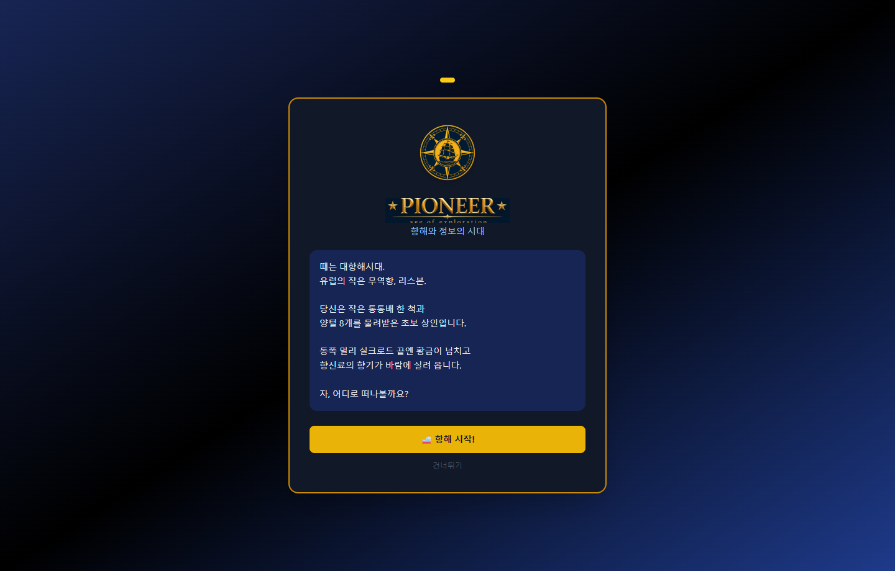
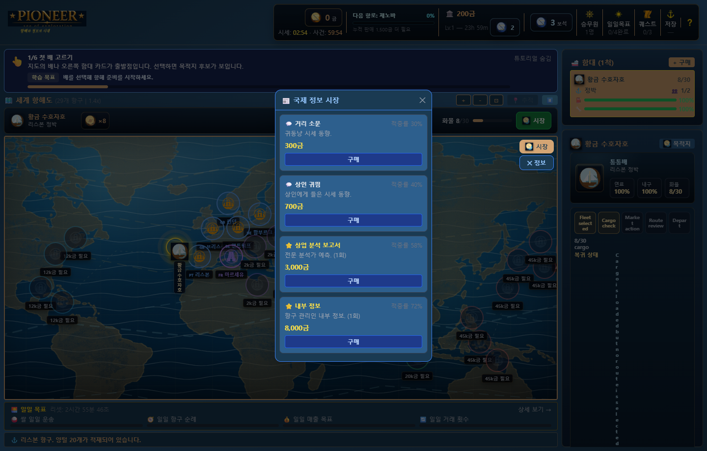
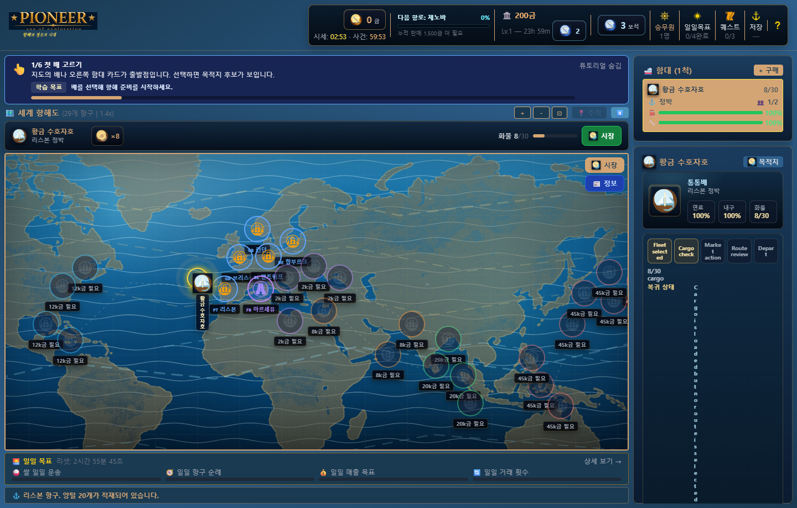
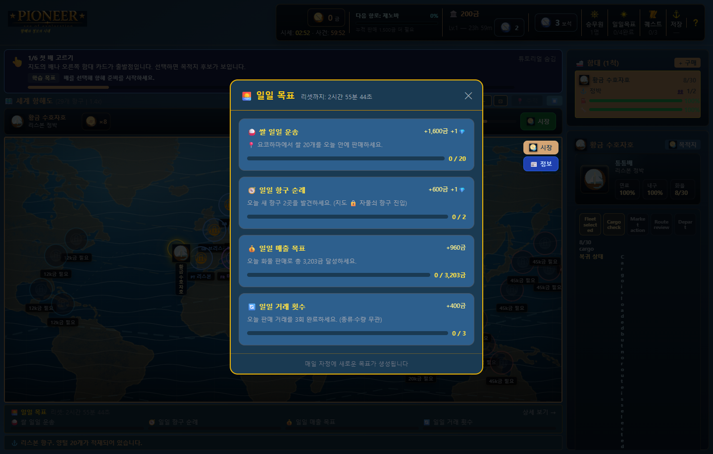
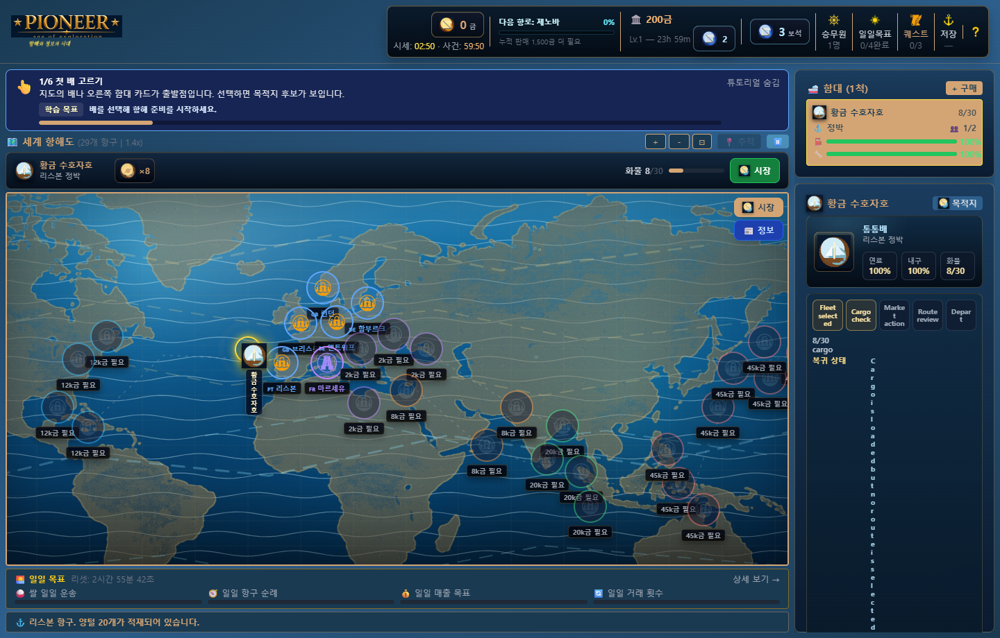
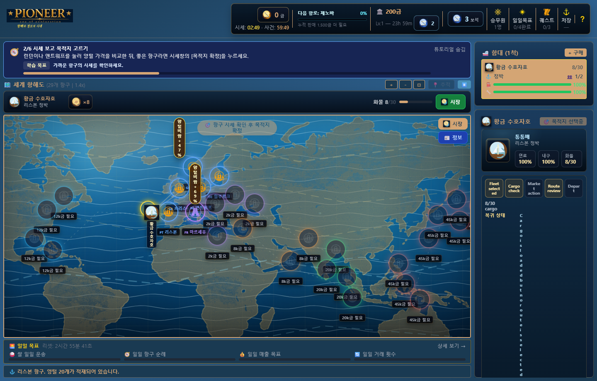
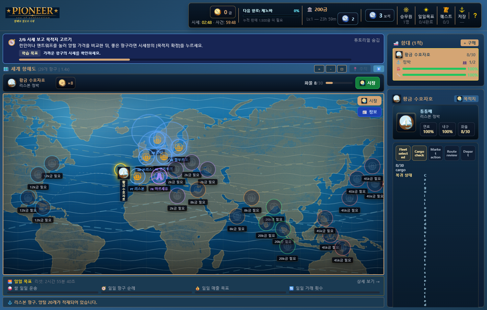
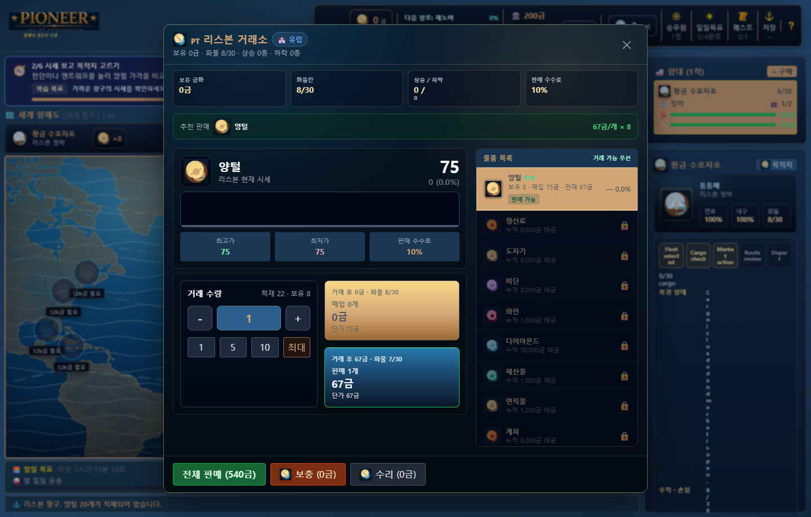
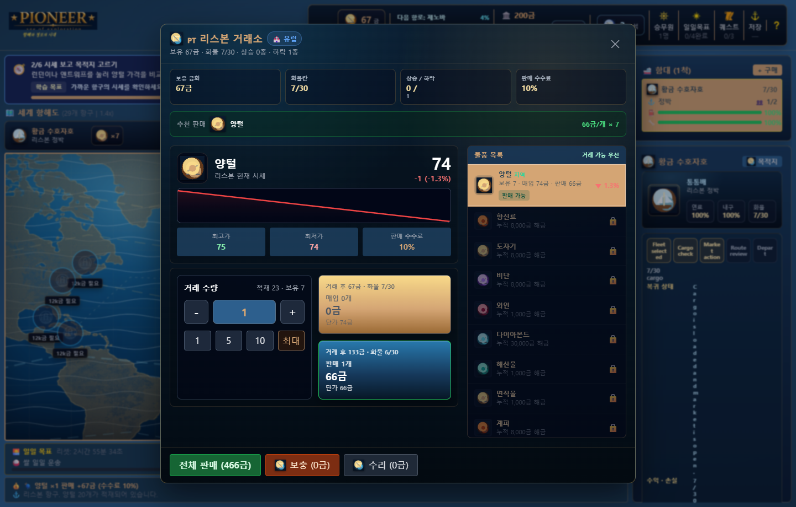

# Pioneer NAN 2026 게임 소개서
**장르:** 대항해 무역 / 함대 경영 / 캐주얼 전략 시뮬레이션  
**플랫폼:** React + Vite 웹 게임, Electron portable 실행파일  
**버전:** v1.8.1 | **작성일:** 2026-08-08 | **실행파일:** `Pioneer_v1.8.1_portable.exe`

---

## 한 줄 소개

Pioneer는 29개 항구의 시세를 읽고, 배와 승무원을 키우며, 3분마다 흔들리는 시장과 1시간마다 터지는 대형 사건 사이에서 항로를 결정하는 대항해 무역 시뮬레이션입니다.

## 제출 매력 포인트

| 매력 | 플레이에서 보이는 장면 | 심사 관점 |
|---|---|---|
| 살아 있는 시장 | 거래소, 시세 타이머, 즉시 거래 피드백 | 반복 플레이마다 가격 기억이 달라지는 전략성 |
| 한 화면 의사결정 | 세계 지도, HUD, 함대 카드, 시장 버튼 | 클릭 수를 줄인 캐주얼 접근성 |
| 성장의 손맛 | 함대, 승무원, 일일 목표, 퀘스트 | 짧은 세션 후에도 다음 목표가 남는 구조 |
| AI 활용 명확성 | 가격 생성/시장 사건/개발 보조 문서화 | 공모전 주제인 AI 활용 근거 제시 |

## 핵심 루프

```text
항구 시세 확인 -> 화물 매입/판매 -> 목적지와 항로 선택 -> 항해 이벤트 관찰
-> 도착 후 거래 -> 선박/승무원 성장 -> 다시 시세 확인
```

## 시장 물가 시스템

- 3분마다 모든 항구/상품의 가격이 소폭 변동합니다.
- 1시간마다 외부 충격인 대형 시장 사건이 발생해 2~4개 항구 가격이 크게 출렁입니다.
- 플레이어의 매입/판매 영향은 거래 즉시 반영되며, 3분 소폭 변동 흐름에만 누적됩니다.
- 대형 시장 사건은 플레이어 거래와 분리된 외부 변수로 처리해 “내가 만든 가격 변화”와 “세계가 흔드는 가격 변화”가 구분됩니다.

## 실제 실행파일 캡처 갤러리

아래 이미지는 `Pioneer_v1.8.1_portable.exe`를 실행한 뒤 내부 localhost 서버 화면을 1440x920 기준으로 캡처한 실제 플레이 화면입니다.

### 스토리 인트로


대항해시대 상인의 첫 출발을 짧고 선명하게 제시합니다.

### 리스본 거래소


보유 화물, 판매 수수료, 가격 변화, 거래 버튼이 한 화면에 묶입니다.

### 세계 항해도


29개 항구, 잠금 조건, HUD, 함대 카드가 동시에 읽히는 기본 플레이 화면입니다.

### 시장 정보


항구별 흐름과 다음 항해 판단을 돕는 정보 패널입니다.

### 승무원 현황


선박별 배치 인원과 능력치 기반 운용 상태를 관리합니다.

### 일일 목표


반복 접속 동기를 주는 단기 목표와 보상 구조입니다.

### 퀘스트


현재 수주/목표 진행도를 확인하는 장면입니다.

### 함대 상세


연료, 내구도, 화물, 승무원 슬롯을 선박 단위로 보여줍니다.

### 항로 선택


목적지 후보와 무역 판단을 자연스럽게 이어줍니다.

### 지도-시장 왕복


항해 지도에서 거래소로 빠르게 돌아오는 흐름입니다.

### 즉시 거래 피드백


거래 직후 자금과 화물 변화가 바로 반영됩니다.

### 실시간 시장 타이머


3분 소폭 변동과 1시간 대형 사건 주기를 계속 노출합니다.

## 구현/검증 현황

| 항목 | 상태 |
|---|---|
| 항구/상품/선박/승무원/퀘스트 기본 루프 | 구현 완료 |
| 3분 소폭 변동 + 1시간 대형 시장 사건 | 구현 완료 |
| 플레이어 거래 즉시 가격 영향 | 구현 완료 |
| Electron portable 실행파일 | `Pioneer_v1.8.1_portable.exe` 배치 완료 |
| 자동 테스트 | `node --test` 32개 통과 기준 |

## 제출 메모

- 게임 소개서, AI 활용 기술문서, 실행파일, 데모 영상 링크/파일을 하나의 제출 묶음으로 관리합니다.
- GDD/기획서 최종 양식 정리는 내용 잠금 후 별도 문서 양식 정돈 단계에서 처리합니다.
