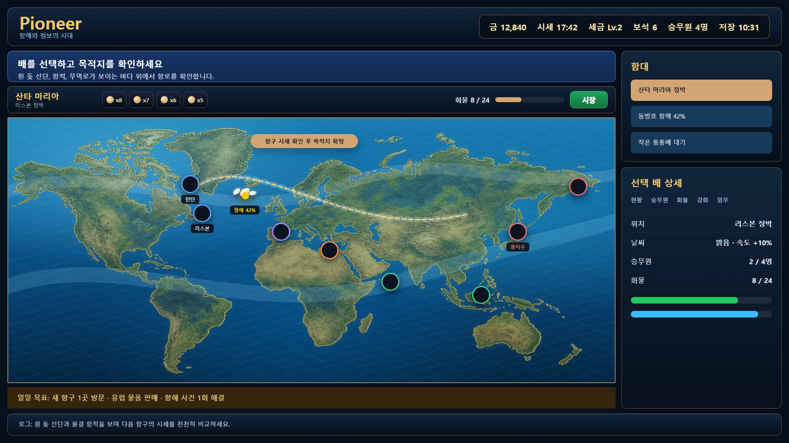

# Pioneer 기획서

---

## 플레이 미리보기

### 플레이 미리보기

---
## 개요

Pioneer는 대항해시대를 배경으로 항구를 오가며 자원을 사고팔고, 선박과 승무원을 성장시키는 항해 경영 게임이다. 플레이어는 지도에서 배와 목적지를 선택하고, 시장 가격·화물·승무원·일일 목표를 관리하며 무역 루프를 확장한다.

## 이번 변경 사항

- 거래소 통합: 항구의 시장 창에서 시세 변동 차트와 물품 매입·판매를 한 번에 처리하도록 통합했다.
- 분할형 거래 UI: 왼쪽 상단에는 선택 물품의 시세 차트·최고/최저가·수수료를, 왼쪽 하단에는 거래 조작부를, 오른쪽에는 물품 목록·보유량·변동률을 배치했다.
- 구매/판매 UX 폴리싱: 수량 스텝퍼, 빠른 수량 버튼, 예상 거래액이 보이는 대형 매입/판매 CTA를 추가했다.
- 거래 판단 보조: 선택 물품의 현재 흐름에 따라 매입/판매 후보 안내를 표시하고, 거래 후 금화와 화물량 변화를 미리 보여준다.
- 물품 목록 강조: 구매 가능하거나 판매 가능한 물품을 목록 상단에 우선 정렬하고, 보유량·매입가·판매가·거래 가능 배지를 더 선명하게 표시한다.
- 거래소 딤드 완화: 거래소 팝업 뒤 배경 어둡기를 낮춰 지도 맥락이 과하게 사라지지 않도록 조정했다.
- 재화 표현 통일: 금화와 보석을 동일한 크기·테두리·숫자 체계의 통화 배지로 정리해 HUD와 주요 소모 버튼의 시각 언어를 맞췄다.
- 항구 해금 UX: 시작 시 리스본 주변의 일부 유럽 항구를 항해 가능 상태로 열어두고, 잠긴 항구는 지도 라벨과 로그에서 필요한 누적 판매금 조건을 표시한다.
- 상시 조언 바: 초반 튜토리얼 단계가 끝나거나 숨겨진 뒤에도 상단 조언 바가 배 선택, 목적지 선택, 판매, 구매, 항로 해금, 항해 추적 같은 다음 행동을 계속 안내한다.
- 초반 화물 밸런스: 시작 선박을 대형 상인선에서 소형 통통배로 낮추고, 시작 양털을 8개로 줄여 초반 화물 관리가 더 명확하게 느껴지도록 조정했다.
- 화물 인벤토리 UI: 지도 하단 화물창과 우측 화물 탭을 슬롯형 인벤토리로 통일해 보유 스택, 빈 슬롯, 예상 판매액을 일반적인 게임 보관함처럼 확인할 수 있게 했다.
- 거래 수수료 고정: 매입에는 수수료를 붙이지 않고, 판매 시에만 승무원 스탯과 무관하게 10% 수수료를 적용한다.
- 항로 선택 조작 정리: 항구 클릭은 항구 정보/시장 확인으로만 처리하고, 항로 지정은 화면에 보이는 배 아이콘 또는 함대 목록에서 배를 먼저 선택한 뒤 목적지 항구를 누르는 방식으로 제한한다.
- 배 중심 목적지 선택: 지도 위 배 아이콘을 직접 클릭하면 해당 배가 선택되고 곧바로 목적지 선택 모드로 들어가며, 항구 클릭만으로는 항로 모드가 시작되지 않는다.
- 목적지 확정형 항로 선택: 배를 선택해 목적지 지정 모드에 들어간 상태에서 항구를 누르면 먼저 해당 항구의 시세창을 보여주고, 시세창의 [목적지 확정] 버튼을 눌렀을 때 출항하도록 바꿨다.
- 정박 항구 클릭 분리: 현재 정박 중인 항구를 누르면 거래소만 열고 시세 팝업을 닫으며, 정박 중이지 않은 방문 항구를 누르면 거래소를 닫고 시세만 보여준다.
- 레이아웃 겹침 완화: 상단 HUD는 줄바꿈 가능한 폭으로 제한하고, 조언 바·목적지 안내·지도 버튼·화물 미니창·항구 해금 라벨이 서로 겹치지 않도록 높이와 위치를 분리했다.
- 거래소 레이아웃 안정화: 물품 목록과 거래 조작부의 최소/최대 폭을 조정하고 하단 액션 버튼을 줄바꿈 가능하게 만들어 좁은 화면에서도 구매/판매 UI가 서로 침범하지 않게 했다.
- 지도 조작 개선: 기본 1배 줌에서도 드래그 이동이 고정되지 않도록 맵 좌표 제한식을 수정하고, 휠/버튼/핀치 줌이 사용자가 바라보는 지점을 중심으로 확대되게 통일했다.
- 바다 항해감 강화: 지도 배경을 수심 그라데이션과 은은한 물결 질감이 있는 해도형 바다로 바꾸고, 해류선·항로 잉크선·이동 중 배 물결 자국·배 흔들림을 추가했다.
- UI/리소스 적용: 필요한 UI 및 리소스 목록을 별도 문서로 정리하고, 금화·보석·거래소·화물·나침반·닻·연료·수리 SVG 아이콘을 새로 제작해 HUD와 거래/항해 버튼에 적용했다. 기존 자원/선박 SVG도 거래소, 화물 인벤토리, 지도 선박, 함대 목록에 연결해 이모지 중심 표현을 줄였다.
- 버튼/프레임 리소스 적용: 패널 프레임, 모달 프레임, 금색 버튼, 해양 버튼, 인벤토리 슬롯 SVG를 제작해 공통 카드, 거래소/시세 팝업, 목적지 확정 버튼, 매입/판매 CTA, 화물 슬롯에 적용했다.
- 날씨 안정화: 선박 날씨가 3분마다 흔들리던 구조를 15분 단위로 완화하고, 항해 중에는 현재 위치가 아니라 항로 중간 위도를 기준으로 계산해 이동 중 날씨가 과하게 자주 바뀌지 않게 했다.
- 항해 사건 빈도 완화: 이동 중 사건 판정을 45초 저확률로 늦추고, 선박별 3분 쿨다운과 최대 동시 사건 2개 제한을 추가했다. 폭풍·해적 같은 강제 사건 가중치도 낮춰 항해 중 방해가 과하게 몰리지 않게 했다.
- 느린 관찰형 루프 전환: 전체 항해 속도를 약 55%로 낮춰 항로를 지켜볼 시간을 늘리고, 부스터를 “순항 보조”로 약화했으며 즉시 도착 버튼을 제거했다. 사건은 45초 저확률·선박별 3분 쿨다운·동시 2개 제한으로 더 드물게 만들고, 시세 갱신은 후반에도 최소 20분 간격을 유지하게 했다.
- 대륙과 우회 항로: 지도에 유럽·아프리카·아라비아·인도·동아시아·아메리카 대륙 실루엣을 추가하고, 장거리 항해는 해상 우회점으로 구성된 항로를 따라 이동하게 했다. 항구 아이콘은 렌더링 시 최소 간격을 유지하도록 배치 보정을 적용해 밀집 지역의 겹침을 줄였다.
- 실제 지형 유사도 개선: Natural Earth 같은 공개 도메인 세계지도 자료를 기준으로 대륙 실루엣을 다시 정리해 북미·남미·그린란드·유럽·아프리카·아라비아·인도·동남아·동아시아·일본/한국·호주가 더 실제 지도와 비슷하게 보이도록 조정했다.
- 대륙 실루엣 폴리싱: 각진 폴리곤으로 보이던 대륙 렌더링을 곡선형 해안선 path와 미세한 해안선 흔들림으로 바꿔 도형 느낌을 줄였다.
- 잠긴 항구 시세 열람: 아직 항로가 잠긴 항구도 클릭하면 시세창을 볼 수 있게 했다. 단, 목적지 확정과 실제 항해는 기존 해금 조건을 만족해야 가능하며 시세창에 항로 잠김과 해금 조건을 함께 표시한다.
- 터치 조작성 개선: 매입/판매 수량 버튼, CTA, 닫기 버튼을 더 큰 터치 영역으로 구성했다.
- 출항 UX 개선: 정박 중인 배가 목적지 항구로 출발할 때 출발 항구 중심과 겹쳐 보이지 않도록, 항구에서 목적지 방향으로 일정 거리 떨어진 지점에서 항해를 시작한다.
- 항해 진행도 보정: 출항 시작 좌표(`startX`, `startY`)를 실제 이격된 위치로 저장해 진행도와 도착 예정 표시가 출발 연출과 일치하게 유지된다.
- 회귀 테스트 추가: 출항 시작 좌표가 출발 항구의 시각 중심에서 3 이상 떨어지는지 검증하는 Node 내장 테스트를 추가했다.

## 기획적 개선 제안

- 초반 온보딩은 “배 선택 → 목적지 선택 → 도착 후 시장 판매”의 다음 행동을 더 크게 강조하고, 일일 목표와 퀘스트는 접힌 요약으로 낮추는 편이 좋다.
- 항구/선박/시장 정보가 동시에 강하게 노출되므로, 지도 위 행동 버튼은 현재 맥락의 1차 행동만 남기고 상세 정보는 우측 패널 탭으로 정리하는 것을 권장한다.
- 출항·도착·판매 같은 주요 순간에는 짧은 시각 피드백을 추가하면 플레이어가 시스템 상태 변화를 더 쉽게 이해할 수 있다.
